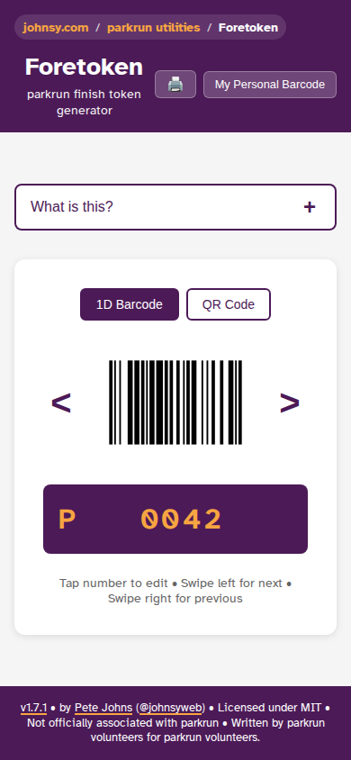

# Foretoken

**parkrun finish token generator for when events run out of physical tokens**



Have you ever been at a parkrun event that has been _so_ popular that the event team has run out of tokens? Folks scramble to resort the used tokens so that the barcode scanners can rescan them for finishers using the parkrun Virtual Volunteer app. It's all a bit stressful. Especially having so many people waiting, in a patient hurry to get to their post-parkrun coffee.

What if each of the finishers were given their position number in a quicker way at the end of the finish funnel? Say, by writing their number on the back of their hand with a pen? Pens are easy to come by.

And when they get to the barcode scanner, they present their personal barcode (often on their phone or smart watch), and a generated finish token on a smartphone screen. Then off to sign up to volunteer for a future event and drink coffee with their mates? Easy!

Enter [johnsy.com/foretoken](https://johnsy.com/foretoken)!

This webapp, optimised for phone usage, will convert a finish position number (say 308), to a finish token barcode ("P0308"), for scanning by the parkrun Virtual Volunteer app. At a popular event that has run out of finish tokens, it should be easy to find a Finish Token Support volunteer with a smart-phone, who can accompany a Barcode Scanner and display the correct generated finish tokens. Want the next sequential one? Swipe left! Or enter the number directly by tapping the token number.

## Features

- **Barcode Generation**: Generate parkrun finish tokens (P#### format) as scannable 1D barcodes or 2D QR codes
- **Mobile Optimized**: Designed for smartphone use with swipe gestures for navigation
- **Direct Entry**: Tap the token number to edit directly, or use URL parameters (e.g., `?position=42`)
- **Print Sheets**: Print replacement finish tokens on A4 or Letter-sized paper (52 or 48 tokens per page respectively)
- **Personal Barcode**: Store your personal parkrun barcode and ICE (In Case of Emergency) details in credit-card sized format for easy sharing
- **Keyboard Navigation**: Full keyboard accessibility including arrow keys (← decreases, → increases) and Enter key support
- **parkrun Colors**: Uses the official parkrun aubergine and apricot color palette for familiarity

## Live Demo

**🌐 Live Site:** [johnsy.com/foretoken](https://johnsy.com/foretoken/)

## Development

### Prerequisites

This project uses:

- **Node.js** (v20 or later)
- **pnpm** (v10 or later) - Package manager
- **Playwright** (for generating OG images and icons)

### Quick Start

1. **Install dependencies**:

   ```bash
   pnpm install
   ```

2. **Install Playwright browsers** (required for icon/OG image generation):

   ```bash
   pnpm exec playwright install chromium
   ```

3. **Start the development server**:

   ```bash
   pnpm dev
   ```

   The app will be available at `http://localhost:3000/foretoken/`

### Available Scripts

- `pnpm dev` - Start development server
- `pnpm build` - Build for production
- `pnpm preview` - Preview production build locally
- `pnpm test` - Run tests once
- `pnpm test:watch` - Run tests in watch mode
- `pnpm test:coverage` - Run tests with coverage report
- `pnpm lint` - Run ESLint
- `pnpm format` - Format code with Prettier
- `pnpm format:check` - Check if code is formatted
- `pnpm type-check` - Check TypeScript types
- `pnpm generate:icons` - Generate favicon and app icons from SVG
- `pnpm generate:og-image` - Generate Open Graph preview image (requires dev server running)
- `pnpm generate:screenshot` - Generate README screenshot (requires dev server running)

### Generating Assets

Icons are generated automatically during the build process (`prebuild` script). The OG image and README screenshot are generated automatically during CI/CD deployment, but can also be generated manually:

```bash
# Generate icons from icon.svg (no server needed)
pnpm generate:icons

# Generate OG image or screenshot (requires dev server running)
# Terminal 1:
pnpm dev

# Terminal 2:
pnpm generate:og-image      # For Open Graph preview image
pnpm generate:screenshot    # For README screenshot
```

**Note:** The screenshot (`screenshot.png`) is automatically generated during the CI/CD build process and committed to the repository.

### Code Quality

This project uses:

- **TypeScript** for type safety
- **ESLint** for linting
- **Prettier** for code formatting
- **Jest** for unit testing
- **Husky** for git hooks (format and lint on commit)

Run all checks:

```bash
pnpm run type-check
pnpm run lint
pnpm run format:check
pnpm test
```

### Testing

Tests are written using Jest and React Testing Library. Run tests with:

```bash
pnpm test                # Run once
pnpm test:watch         # Watch mode
pnpm test:coverage      # With coverage report
```

### Building for Production

```bash
pnpm build
```

The build output will be in the `dist/` directory, configured for deployment at the `/foretoken/` base path.

## CI/CD

This project uses GitHub Actions for continuous integration and deployment:

- **CI Workflow**: Runs on all pushes and pull requests
  - Format checking with Prettier
  - Linting with ESLint
  - Type checking with TypeScript
  - Test suite with Jest

- **Publish Workflow**: Deploys to GitHub Pages on main branch
  - Runs after CI succeeds
  - Builds production website
  - Automatically deploys to GitHub Pages at `/foretoken/`

- **Dependabot**: Keeps dependencies up to date
  - Weekly updates for npm packages and GitHub Actions
  - Groups minor and patch updates
  - Auto-merges when CI passes

### URL Parameters

The app supports URL parameters for direct navigation:

- `?position=42` - Jump directly to position 42 (displays token P0042)

Example: `https://johnsy.com/foretoken/?position=42`

## Technical Details

- **Framework**: React 18 with TypeScript
- **Build Tool**: Vite
- **Testing**: Jest with React Testing Library
- **Barcode Generation**:
  - 1D: `react-barcode` (CODE128 format)
  - 2D: `qrcode.react` (QR Code)
- **Icons/OG Images**: Generated using Playwright
- **Color Palette**: parkrun aubergine (#4A2142) and apricot (#F4A460)

## License

MIT

**Note**: This app uses the parkrun.com color palette for familiarity but is not officially associated with parkrun. It is written by a parkrun volunteer for parkrun volunteers. It is and always will be free.
