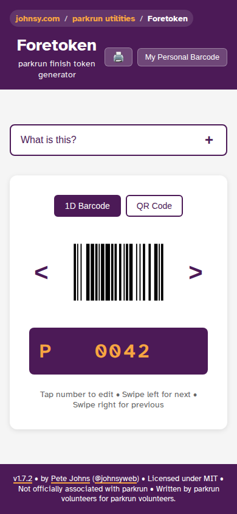

# Foretoken

**Free parkrun finish token generator for when events run out of physical tokens**



**Foretoken** is a mobile-optimized tool that generates P#### barcodes and QR codes for parkrun events. It's perfect for parkrun volunteers and event organizers who need to support finishers when physical tokens are unavailable. The app features swipe gestures for easy navigation, 1D barcodes and 2D QR code support, and the ability to print replacement tokens on standard paper.

### The Problem

Have you ever been at a parkrun event that has been _so_ popular that the event team has run out of tokens? Folks scramble to resort the used tokens so that the barcode scanners can rescan them for finishers using the parkrun Virtual Volunteer app. It's all a bit stressful. Especially having so many people waiting, in a patient hurry to get to their post-parkrun coffee.

### The Solution

What if each of the finishers were given their position number in a quicker way at the end of the finish funnel? Say, by writing their number on the back of their hand with a pen? Pens are easy to come by.

And when they get to the barcode scanner, they present their personal barcode (often on their phone or smart watch), and a generated finish token on a smartphone screen. Then off to sign up to volunteer for a future event and drink coffee with their mates? Easy!

Enter [www.johnsy.com/foretoken](https://www.johnsy.com/foretoken)!

This webapp, optimised for phone usage, will convert a finish position number (say 308), to a finish token barcode ("P0308"), for scanning by the parkrun Virtual Volunteer app. At a popular event that has run out of finish tokens, it should be easy to find a Finish Token Support volunteer with a smart-phone, who can accompany a Barcode Scanner and display the correct generated finish tokens. Want the next sequential one? Swipe left! Or enter the number directly by tapping the token number.

## Usage in the Wild

- **Date/location context:** Christmas Day 2025, Australian event
- **Operational scenario:** attendance demand exceeded available physical finish tokens
- **Scale metric:** 270 finish tokens scanned using Foretoken
- **Source:** [Field example (Facebook reel)](https://www.facebook.com/reel/1626035418809433/?comment_id=898138015977568&reply_comment_id=918261480936007&__tn__=R)
- **Notes/caveats:** This is a field report, not a controlled benchmark

We welcome usage stories at [foretoken@johnsy.com](mailto:foretoken@johnsy.com). For submission format, consent, and anonymity details, see [CONTRIBUTING.md](./CONTRIBUTING.md).

## How Foretoken Compares

When choosing an option under event pressure, start with official guidance and then pick the tool that best matches your workflow.

| Option                                                                                                      | Primary use case                                       | Delivery mode                  | Works on phone at finish funnel                        | QR token support             | Batch print support            | Setup complexity                               | License                  | Maintenance signal              |
| ----------------------------------------------------------------------------------------------------------- | ------------------------------------------------------ | ------------------------------ | ------------------------------------------------------ | ---------------------------- | ------------------------------ | ---------------------------------------------- | ------------------------ | ------------------------------- |
| [parkrun Emergency Reprints](https://wiki.parkrun.com/index.php/Finish_Position_Barcode#Emergency_Reprints) | Official fallback process for emergency token handling | Official documentation/process | Not primarily designed for live phone display workflow | Not specified as QR-first    | Yes, process supports reprints | Low if your team already uses official process | Official parkrun process | Maintained as official guidance |
| [johnsyweb/foretoken](https://github.com/johnsyweb/foretoken)                                               | On-day live token display plus optional prep printing  | Frontend static web app        | Yes                                                    | Yes                          | Yes                            | Low                                            | MIT                      | Active                          |
| [Jake-Lofthouse/parkrun-token-generator](https://github.com/Jake-Lofthouse/parkrun-token-generator)         | Token generation and printing alternative              | Frontend web app               | Partial/varies by device                               | Not a stated primary feature | Yes                            | Low to medium                                  | MIT                      | Active                          |
| [jones139/parkrun_tokens](https://github.com/jones139/parkrun_tokens)                                       | Print-focused token generation workflow                | Python script/app              | No (desktop/script-oriented)                           | Not a stated primary feature | Yes                            | Medium                                         | GPL-3.0                  | Active                          |

Choose this when:

- Choose official emergency reprints when your team already uses that process and you need the minimum process change.
- Choose Foretoken when you need fast, on-day, phone-based token display at the finish funnel and scanner flow.
- Choose print-focused alternatives when preparing large printed batches in advance is your primary need.

## Features

- **Barcode Generation**: Generate parkrun finish tokens (P#### format) as scannable 1D barcodes or 2D QR codes
- **Mobile Optimized**: Designed for smartphone use with swipe gestures for navigation
- **Installable**: Can be added to home screen on iOS and Android for quick access during events
- **Direct Entry**: Tap the token number to edit directly, or use URL parameters (e.g., `?position=42`)
- **Print Sheets**: Print replacement finish tokens on A4 or Letter-sized paper (52 or 48 tokens per page respectively) - ideal for preparing tokens in advance when large attendance is anticipated
- **Personal Barcode**: Store your personal parkrun barcode and ICE (In Case of Emergency) details in credit-card sized format for easy sharing
- **Keyboard Navigation**: Full keyboard accessibility including arrow keys (← decreases, → increases) and Enter key support
- **parkrun Colors**: Uses the official parkrun aubergine and apricot color palette for familiarity

## Live Demo

**🌐 Live Site:** [www.johnsy.com/foretoken](https://www.johnsy.com/foretoken/)

### Adding to Home Screen

For quick access during parkrun events, volunteers can add Foretoken to their device's home screen:

- **iPhone/iPad (Safari)**: Tap the Share button 📤 at the bottom, scroll down and tap "Add to Home Screen"
- **Android (Chrome/Edge)**: Tap the menu ☰ (three dots), then tap "Add to Home screen" or "Install app"

Once added, Foretoken will appear on the home screen like a regular app for easy access during events.

## Development

### Prerequisites

This project uses:

- **mise** (formerly rtx) - Runtime version manager (see `.tool-versions`)
- **Node.js** (version specified in `.tool-versions`)
- **pnpm** (version specified in `.tool-versions`) - Package manager
- **Playwright** (for generating OG images and icons)

Versions are managed via `.tool-versions` for mise. The CI/CD workflows automatically read versions from this file.

### Quick Start

1. **Install dependencies**:

   ```bash
   pnpm install
   ```

2. **Install Playwright browsers** (required for icon/OG image generation):

   ```bash
   pnpm exec playwright install chromium
   ```

3. **Start the development server**:

   ```bash
   pnpm dev
   ```

   The app will be available at `http://localhost:3000/foretoken/`

### Available Scripts

- `pnpm dev` - Start development server
- `pnpm build` - Build for production
- `pnpm preview` - Preview production build locally
- `pnpm test` - Run tests once
- `pnpm test:watch` - Run tests in watch mode
- `pnpm test:coverage` - Run tests with coverage report
- `pnpm lint` - Run ESLint
- `pnpm format` - Format code with Prettier
- `pnpm format:check` - Check if code is formatted
- `pnpm type-check` - Check TypeScript types
- `pnpm generate:icons` - Generate favicon and app icons from SVG
- `pnpm generate:og-image` - Generate Open Graph preview image (requires dev server running)
- `pnpm generate:screenshot` - Generate README screenshot (requires dev server running)
- `pnpm release` - Run semantic-release (typically run automatically by CI/CD)

### Generating Assets

Icons are generated automatically during the build process (`prebuild` script). The OG image and README screenshot are generated automatically during CI/CD deployment, but can also be generated manually:

```bash
# Generate icons from icon.svg (no server needed)
pnpm generate:icons

# Generate OG image or screenshot (requires dev server running)
# Terminal 1:
pnpm dev

# Terminal 2:
pnpm generate:og-image      # For Open Graph preview image
pnpm generate:screenshot    # For README screenshot
```

**Note:** The screenshot (`screenshot.png`) is automatically generated during the CI/CD build process and committed to the repository.

### Code Quality

This project uses:

- **TypeScript** for type safety
- **ESLint** for linting
- **Prettier** for code formatting
- **Jest** for unit testing
- **Husky** for git hooks (format and lint on commit)

Run all checks:

```bash
pnpm run type-check
pnpm run lint
pnpm run format:check
pnpm test
```

### Testing

Tests are written using Jest and React Testing Library. Run tests with:

```bash
pnpm test                # Run once
pnpm test:watch         # Watch mode
pnpm test:coverage      # With coverage report
```

### Building for Production

```bash
pnpm build
```

The build output will be in the `dist/` directory, configured for deployment at the `/foretoken/` base path.

## CI/CD

This project uses GitHub Actions for continuous integration and deployment:

- **CI Workflow**: Runs on all pushes and pull requests
  - Format checking with Prettier
  - Linting with ESLint
  - Type checking with TypeScript
  - Test suite with Jest

- **Release and Publish Workflow**: Runs after CI succeeds on main branch
  - **Release job**: Automatically creates releases using semantic-release
    - Analyzes commits for version bumps
    - Generates changelog
    - Creates git tags
    - Updates version in package.json
  - **Publish job**: Deploys to GitHub Pages
    - Builds production website
    - Automatically deploys to GitHub Pages at `/foretoken/`

- **Dependabot**: Keeps dependencies up to date
  - Weekly updates for npm packages and GitHub Actions
  - Groups minor and patch updates
  - Auto-merges when CI passes

### URL Parameters

The app supports URL parameters for direct navigation:

- `?position=42` - Jump directly to position 42 (displays token P0042)
- `?code=qr` - Display tokens as QR codes (applies to finish tokens and Personal Barcode)
  - Use `?code=1d` (or omit) to display 1D CODE128 barcodes

Examples:

- `https://www.johnsy.com/foretoken/?position=42`
- `https://www.johnsy.com/foretoken/?position=42&code=qr`

Notes:

- The `code` selection is reflected in the UI toggle and is kept in the URL, so you can share a link that opens in the same mode.
- The selection affects both the finish token display and the Personal Barcode view.

## Technical Details

- **Framework**: React 18 with TypeScript
- **Build Tool**: Vite
- **Testing**: Jest with React Testing Library
- **Barcode Generation**:
  - 1D: `react-barcode` (CODE128 format)
  - 2D: `qrcode.react` (QR Code)
- **Icons/OG Images**: Generated using Playwright
- **Color Palette**: parkrun aubergine (#4A2142) and apricot (#F4A460)

## Versioning

This project follows [Semantic Versioning](https://semver.org/) (semver) and uses [semantic-release](https://github.com/semantic-release/semantic-release) to automatically determine version numbers and generate changelogs from commit messages. The current version is displayed in the footer and links to the [CHANGELOG.md](https://github.com/johnsyweb/foretoken/blob/main/CHANGELOG.md) on GitHub.

### Releasing

Releases are handled automatically by semantic-release when commits are pushed to the `main` branch. The tool:

- Analyzes commit messages (following [Conventional Commits](https://www.conventionalcommits.org/))
- Determines the appropriate version bump (major, minor, or patch)
- Generates the changelog automatically
- Creates a git tag
- Updates `package.json` with the new version

To create a release, simply ensure your commits follow the conventional commit format (e.g., `feat:`, `fix:`, `docs:`) and push to `main`. The release process runs automatically via CI/CD.

## License

MIT

**Note**: This app uses the parkrun.com color palette for familiarity but is not officially associated with parkrun. It is written by a parkrun volunteer for parkrun volunteers. It is and always will be free.
